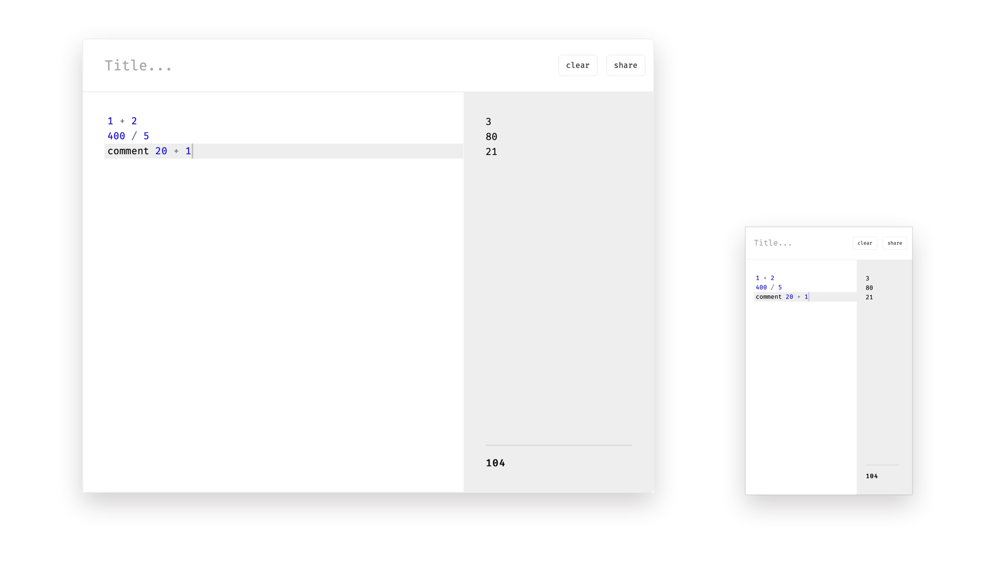

# Napkin
A quick calculator app in the style of Numi and Soulver.
It tries to be the middleground between Excel and Calculator. 
Use it to count calories, tips, or anything else.
Built as a progressive web app using Vue CLI, for offline use.  

[Try it out!](https://reinvdwoerd.github.io/reinvdwoerd/napkin/)




## Project setup
```
npm install
```

### Compiles and hot-reloads for development
```
npm run serve
```

### Compiles and minifies for production
```
npm run build
```


### Customize configuration
See [Configuration Reference](https://cli.vuejs.org/config/).
